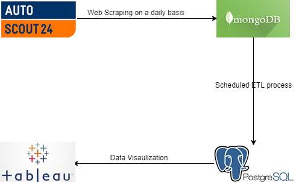

The main goal of this project is to create  a Data Warehouse containing aggregated information about used cars put on sale. The data itself is retrieved from the [Autoscout24 website](https://www.autoscout24.com/). This process of gathering the data is done with web scraping the data from the website mentioned earlier. Given the fact that we are dealing with sparse data, having many null values, we choose to use a *unstructuted document based database*,[MongoDB](https://www.mongodb.com/), for storing it. This represents the first step in the creation of a fully functional system behind the Data Warehouse.   Next we hosted our warehouse on [PostgreSQL](https://www.postgresql.org/). A data warehouse by convention stores records of structured data, so for obvious reasons a relational database was chosen. Lastly we need a scheduled update of both the database and the warehouse. The database would get the records directly from the website and the warehouse would then collect them from the database and conduct all the ETL processes needed. Lastly these results can be visualized using some data visualization tool such as Tableau or Microsoft Power BI.     Bellow you can see a graphical representation of the workflow.
  

 

So to recap, there are a few steps in order to get the system going:
- Create and host a MongoDB database and a PostgreSQL Warehouse
- Come up with a schema for the Warehouse and for the database if needed
- Find a way to regulary update the database and data warehouse
- Visualize the data in the Warehouse

These steps will be further discussed in the following pages.